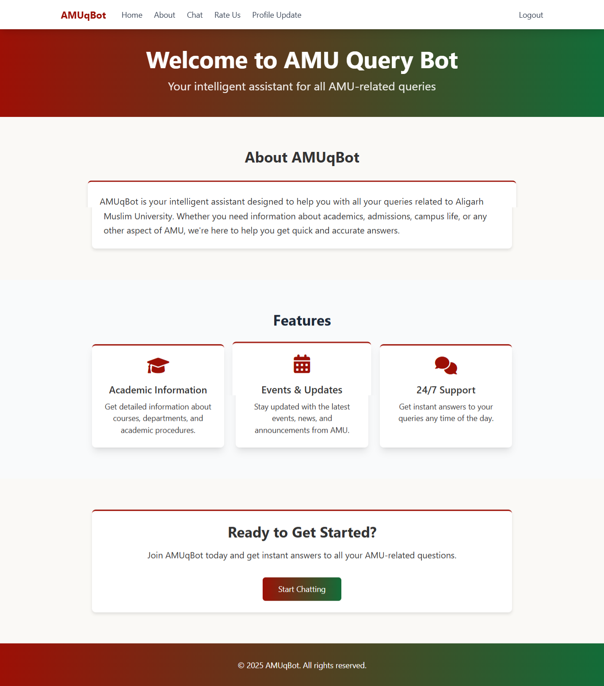
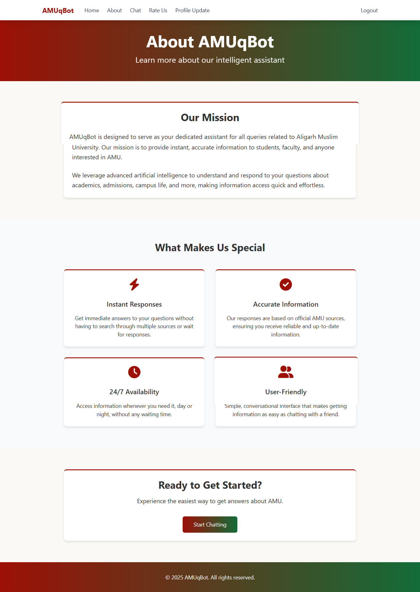
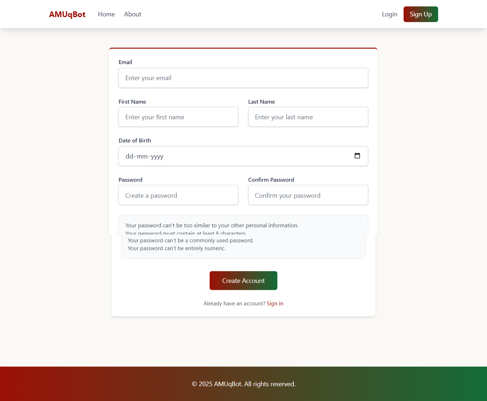
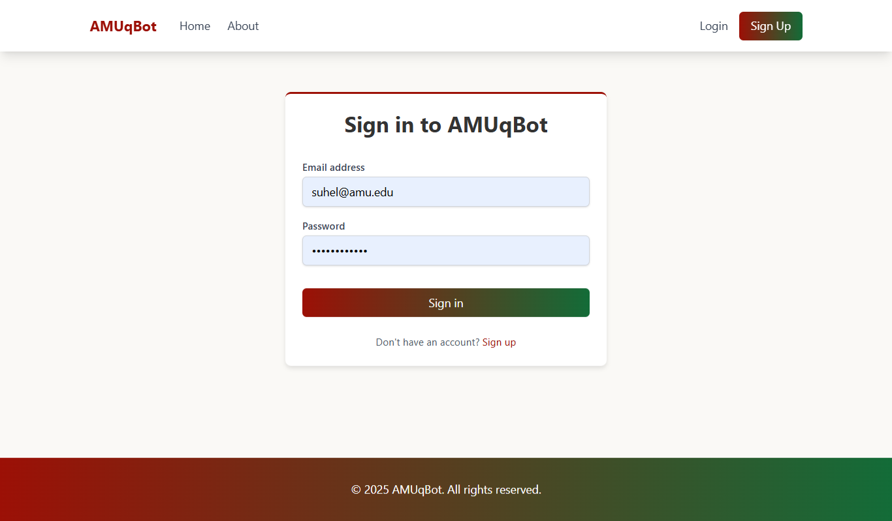
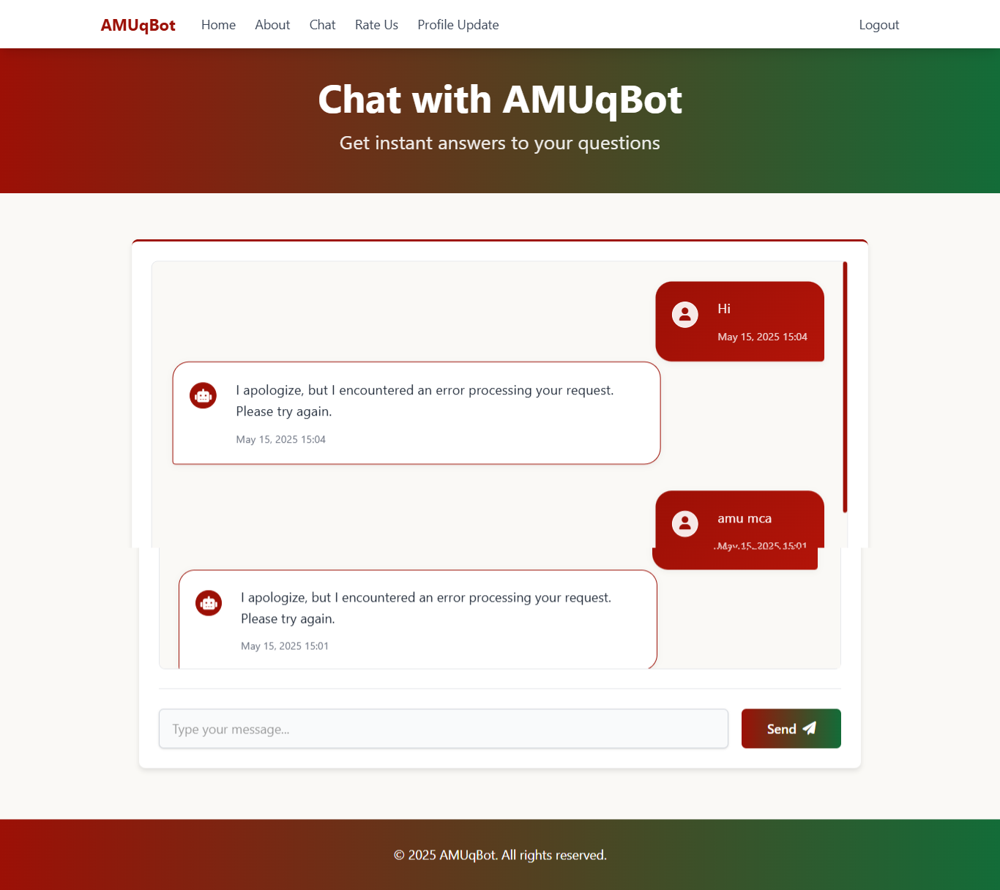
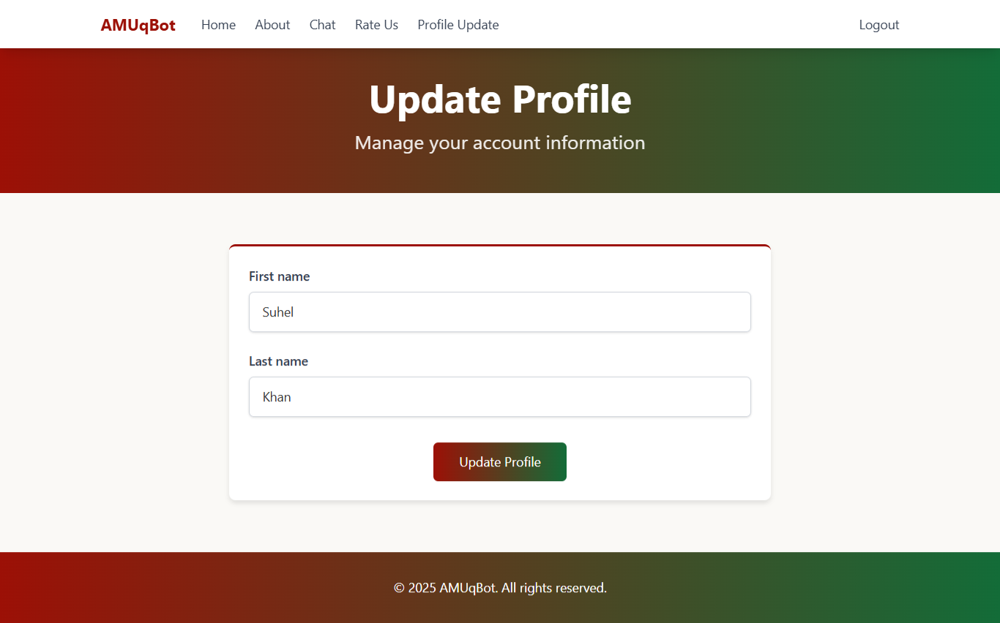
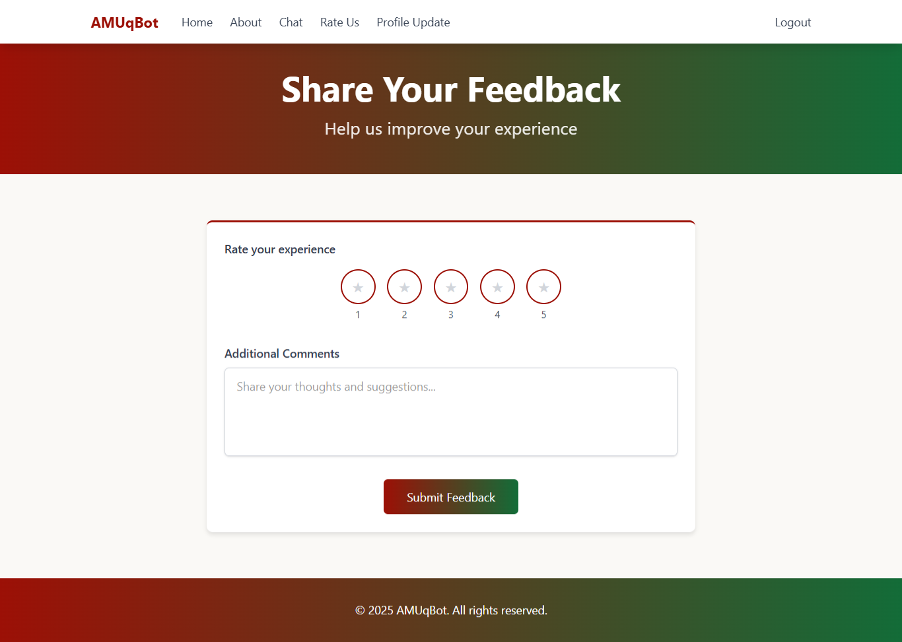

# AMUqBot Documentation

## Table of Contents
1. [Introduction](#introduction)
2. [System Architecture](#system-architecture)
3. [Installation Guide](#installation-guide)
4. [Configuration](#configuration)
5. [User Guide](#user-guide)
6. [Developer Guide](#developer-guide)
7. [Techinical Architecture](#technical-architecture)
8. [Troubleshooting](#troubleshooting)

## Introduction

AMUqBot is a comprehensive query management system designed specifically for Aligarh Muslim University (AMU). It provides a modern, efficient platform for handling academic queries, document management, and real-time discussions.

### Key Features
- **User Authentication**: Secure login system with role-based access control
- **Document Management**: Upload, store, and manage academic documents
- **Query System**: Submit, track, and manage academic queries
- **Real-time Communication**: WebSocket-based discussion system
- **Responsive Design**: Mobile-friendly interface using Tailwind CSS

## System Architecture

### Technology Stack
- **Backend Framework**: Django 5.2
- **Frontend**: Tailwind CSS
- **Database**: SQLite3
- **Real-time Communication**: Django Channels
- **Server**: Daphne (ASGI server)
- **Template Engine**: Jinja2

### Project Structure
```
AMUqBot/
├── amu_query_bot/         # Main Django project
│   ├── core/             # Core application
│   │   ├── models.py     # Database models
│   │   ├── views.py      # View logic
│   │   └── urls.py       # URL routing
│   ├── documents/        # Document management
│   ├── users/           # User management
│   ├── templates/       # HTML templates
│   └── static/          # Static files
├── docs/                # Documentation
└── requirements.txt     # Python dependencies
```

## Installation Guide

### Prerequisites
- Python 3.x
- Node.js and npm
- Git

### Step-by-Step Installation

1. **Clone the Repository**
   ```bash
   git clone https://github.com/yourusername/AMUqBot.git
   cd AMUqBot
   ```

2. **Set Up Virtual Environment**
   ```bash
   python -m venv .venv
   # Windows
   .venv\Scripts\activate
   # Unix/MacOS
   source .venv/bin/activate
   ```

3. **Install Dependencies**
   ```bash
   pip install -r requirements.txt
   npm install
   ```

4. **Database Setup**
   ```bash
   cd amu_query_bot
   python manage.py migrate
   python manage.py createsuperuser
   ```

5. **Run Development Server**
   ```bash
   python manage.py runserver
   ```

## Configuration

### Environment Variables
Create a `.env` file in the project root with the following variables:
```
DEBUG=True
SECRET_KEY=your-secret-key
DATABASE_URL=sqlite:///db.sqlite3
```

### Database Configuration
The project uses SQLite by default. For production, configure your preferred database in `settings.py`.

## User Guide

### User Roles
1. **Student**
   - Submit queries
   - Upload documents
   - Participate in discussions

2. **Faculty**
   - Respond to queries
   - Manage documents
   - Moderate discussions

3. **Admin**
   - Manage users
   - System configuration
   - Access all features

### Using the System

#### Submitting a Query
1. Log in to your account
2. Navigate to "New Query"
3. Fill in the query details
4. Attach relevant documents
5. Submit

#### Document Management
1. Access the document section
2. Upload new documents
3. Organize in folders
4. Share with relevant users

#### Real-time Discussion
1. Join a discussion room
2. Send messages in real-time
3. Share files and links
4. Use @mentions for specific users

## Developer Guide

### Setting Up Development Environment
1. Fork the repository
2. Create a feature branch
3. Set up pre-commit hooks
4. Follow coding standards

### Code Style
- Follow PEP 8 guidelines
- Use meaningful variable names
- Write docstrings for functions
- Include type hints

### Testing
```bash
python manage.py test
```

# Technical Architecture

## System Overview

AMUqBot is built using a modern web architecture that emphasizes scalability, maintainability, and real-time capabilities.

### Architecture Diagram
```
┌─────────────────┐     ┌─────────────────┐     ┌─────────────────┐
│   Client Layer  │     │  Application    │     │   Data Layer    │
│  (Frontend)     │◄───►│  Layer (Django) │◄───►│  (Database)     │
└─────────────────┘     └─────────────────┘     └─────────────────┘
        ▲                        ▲                        ▲
        │                        │                        │
        ▼                        ▼                        ▼
┌─────────────────┐     ┌─────────────────┐     ┌─────────────────┐
│  WebSockets     │     │  Task Queue     │     │  File Storage   │
│  (Channels)     │     │  (Celery)       │     │  (Media)        │
└─────────────────┘     └─────────────────┘     └─────────────────┘
```

## Component Details

### 1. Frontend Architecture
- **Framework**: Tailwind CSS
- **State Management**: Alpine.js
- **Real-time Updates**: WebSocket client
- **Build System**: Webpack

### 2. Backend Architecture
- **Framework**: Django 5.2
- **ASGI Server**: Daphne
- **Task Queue**: Celery
- **Caching**: Redis
- **WebSockets**: Django Channels

### 3. Database Architecture
- **Primary Database**: SQLite3 (Development)
- **Production Database**: PostgreSQL
- **Caching Layer**: Redis
- **Search Engine**: Elasticsearch (Optional)

### 4. Security Architecture
- **Authentication**: Django Authentication System
- **Authorization**: Role-Based Access Control (RBAC)
- **Data Encryption**: AES-256
- **HTTPS**: TLS 1.3

### 5. Deployment Architecture
- **Web Server**: Nginx
- **Application Server**: Daphne
- **Process Manager**: Supervisor
- **Containerization**: Docker
- **CI/CD**: GitHub Actions

## Data Flow

### Query Submission Flow
1. User submits query through frontend
2. Request validated by Django middleware
3. Query stored in database
4. Notification sent through WebSocket
5. Email notification sent (optional)

### Real-time Communication Flow
1. WebSocket connection established
2. Messages routed through Django Channels
3. Redis backend for message persistence
4. Real-time updates to connected clients

## Performance Considerations

### Caching Strategy
- **Page Caching**: 5 minutes
- **API Response Caching**: 1 minute
- **Static Asset Caching**: 1 week
- **Database Query Caching**: 15 minutes

### Database Optimization
- Indexed fields
- Query optimization
- Connection pooling
- Regular maintenance

### Load Balancing
- Horizontal scaling
- Round-robin distribution
- Health checks
- Failover configuration

## Monitoring and Logging

### Monitoring Tools
- **Application**: New Relic
- **Server**: Prometheus
- **Logging**: ELK Stack
- **Error Tracking**: Sentry

### Key Metrics
- Response time
- Error rates
- User sessions
- Resource utilization
- Database performance

## Backup and Recovery

### Backup Strategy
- Daily database backups
- Weekly full system backups
- Real-time file replication
- Off-site storage

### Recovery Procedures
- Point-in-time recovery
- Database restoration
- File system recovery
- Service restoration

## Development Workflow

### Version Control
- Git flow branching model
- Feature branches
- Release branches
- Hotfix branches

### Code Quality
- PEP 8 compliance
- Type checking
- Unit testing
- Integration testing
- Code review process

## Security Measures

### Application Security
- CSRF protection
- XSS prevention
- SQL injection protection
- Rate limiting
- Input validation

### Infrastructure Security
- Firewall configuration
- SSL/TLS encryption
- Regular security audits
- Vulnerability scanning
- Access control lists 

## Troubleshooting

### Common Issues

1. **Database Migration Errors**
   ```bash
   python manage.py makemigrations
   python manage.py migrate --run-syncdb
   ```

2. **Static Files Not Loading**
   ```bash
   python manage.py collectstatic
   ```

3. **WebSocket Connection Issues**
   - Check Daphne server status
   - Verify ASGI configuration
   - Check firewall settings

### Getting Help
- Check the [GitHub Issues](https://github.com/suhelkhanca/AMUqBot/issues)
- Contact the development team
- Join the community forum

## Screenshot
















## Contributing

Please read PR practices for details on our code of conduct and the process for submitting pull requests.

## License

This project is licensed under the MIT License - see the [LICENSE](../LICENSE) file for details. 

## 📫 Let's Connect

- GitHub: [SuhelKhanCA](https://github.com/SuhelKhanCA)
- LinkedIn: [Suhel Khan](https://www.linkedin.com/in/suhelkhanska/)
- Twitter: [Suhel Khan](https://twitter.com/@suhelkhanalig)
- Email: suhelkhanca@gmail.com